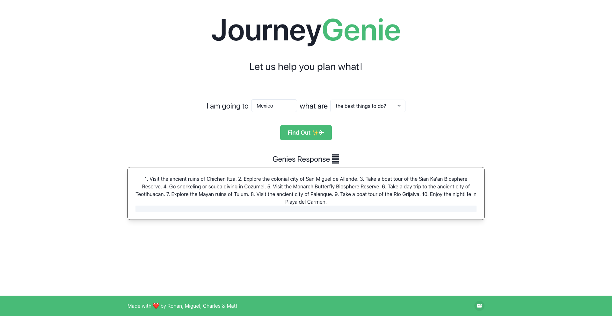

# JourneyGenie 🧞‍♂️

JourneyGenie is an application that will tell you the all the components you need for a PERFECT trip ✈️. 
The application is hosted on Vercel [here](vercel.com).

Proudly build during [TreasureHacks 3.0](https://treasure-hacks-3-0.devpost.com/).

## Screenshots

## Inspiration
With the focus of 'Life is a Game' theme,  we wanted to have a project that made a life activity (travelling) more efficient. When you travel to a new location you want to make the most of the trip by experience the best the travel has to offer.

As avid travellers, we often travelled to a new places but had no idea about what the best places to go were. We wished for an easy way to be able to input our location and be returned with the best options. 

## Core Functionality
At it's core, JourneyGenie allows users to put in their travel location (ex: Mexico), and then choose amongst 5 main options: \
⚡️ The Best Places to Go \
⚡️ The Best Things to Do \
⚡️ The Best Travel Tips \
⚡️ The Best Clothes to Bring \
⚡️ The Best Times to Go

The "Genie" then takes the response to another level by introducing DaVinci AI to be able to determine the most optimal travel experience. Users can then have a quick answer to their travel questions. Additionally, the user is displayed with relevant widgets towards the location of the place they were looking to travel to.

## How We Built It
The frontend of our web application itself was built using pure typescript with HTML as well as CSS elements. When the user decides to input the location, the answers are same in local storage and sends the info to OpenAI to process the answer. The main backend is API calls to OpenAI. The end result uses Conversatinal AI to determine the optimal travel experience.

## Challenges We Ran Into
The majority of the API calls to OpenAI were relatively unknown to us before. Additionally, inputting the final result into the 'Genie' textbox while removing the loading bars was a bit challenging. We learned how to use local storage to save previous answers. Lastly, 

## Accomplishments We Are Proud Of
We are incredibly proud of our extreme resilient commitment to the project throughout the 24 hour hackathon. We are quite happy with our front end design, and the 'Genie' user experience of the answer. Lastly, we're extremely content with the fact that we are able to successfully connect our frontend and backend together to effectively make API calls, completing the conversational AI process.

## What's Next for JourneyGenie
Our future plans include implementing more widget optionality for each location inputted. In addition to our web app, we could also look into making a mobile app so that you can find optimal travel experiences on your phone as well. Lastly, could look into implementing a model that adjusts based on user interests and generates answers according to the user's personal likes and dislikes.
